##  使用百度AI开放平台的图片搜索产品服务, 测试图片搜索

图片搜索应用场景:  **电商平台相似商品推荐、同款商品搜索, 重复图片过滤, 图片素材搜索**

开始之前:  百度AI今年开放很多技术的SDK,  部分是有限制的, 比如最感兴趣的图片搜索功能,  自已可以自建图库实现图片搜索, 但是刚开始的时间只能企业申请, 我这个人用户, 想玩下没办法, 最近登陆百度AI开发平台时发现, 取消了这个限制任何人都可以申请使用, 就来试一把, 看下图片搜索的效果如何, 这里只测试**相似图搜索**, 下面开始吧. 

# 1, 创建应用

## A, 找到图像搜索

想要使用必须先创建应用, 首先登陆百度AI平台: https://ai.baidu.com,  再产品服务里找到图像搜索, 如下图所示:

( **PS: 图像搜索在下面需要鼠标中键滚动下!** )

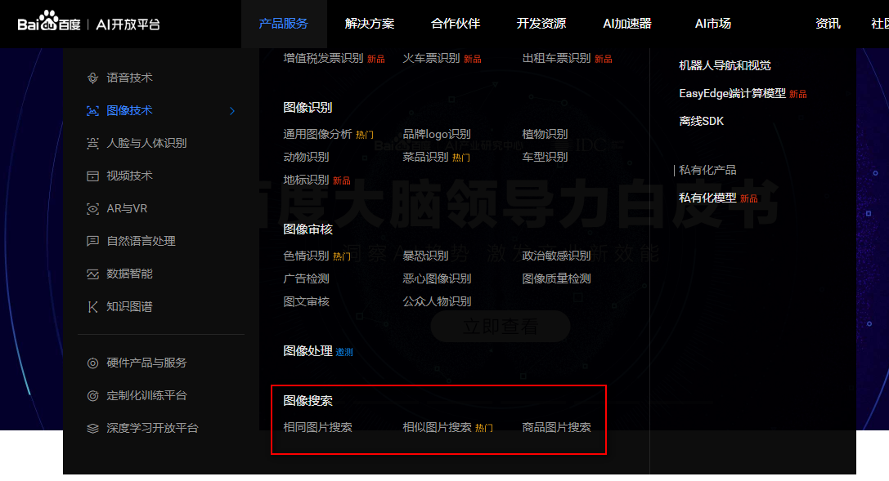

**点击后进入如下界面:**

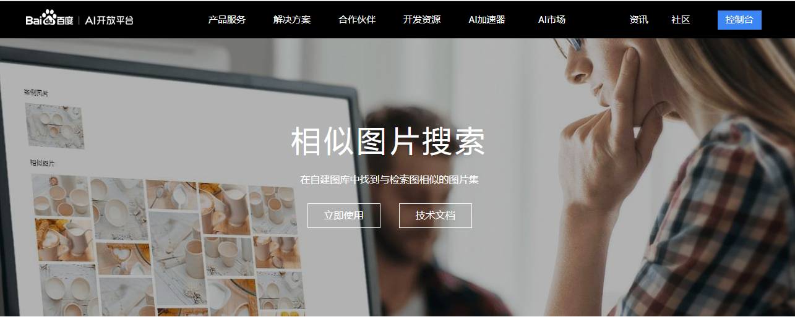

继续点击**立即使用**, 然后进入控制台, 如果还未登陆这时需要登陆, 如果没有帐号申请一个即可, 控制台界面如下:

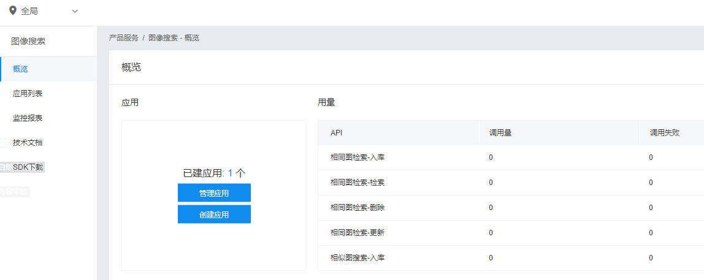

## B, 创建应用

我这里之前已经创建了一个应用,  显示已建应用1个,  创建新应用时, 进接点击**创建应用**即可, 界面如下:

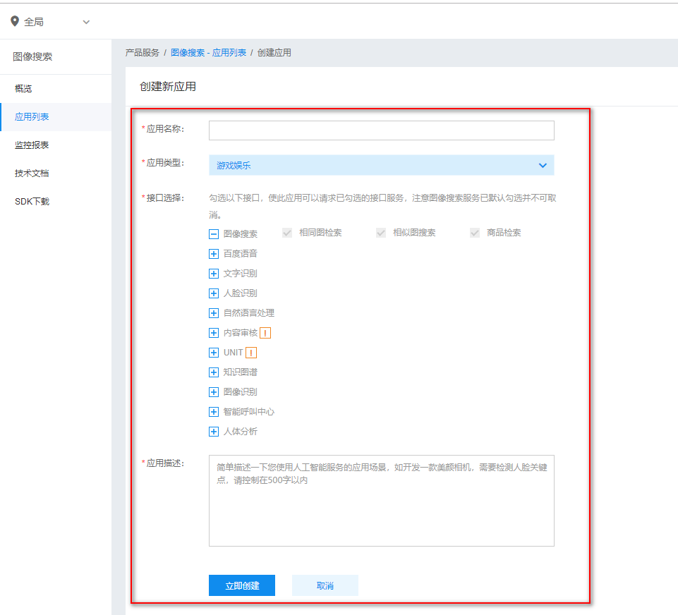

按照你的实际情况填写即可! 然后点击 **立即创建**

## C, 图片建库

这里只测试相似图片搜索, 所以只申请相似图片的库, 步骤如下:

在应用列表里, 找到你创建的应用, 点击**管理**, 如下图:


点击后新的界面向下找, 找到**相似图图库管理**如下:

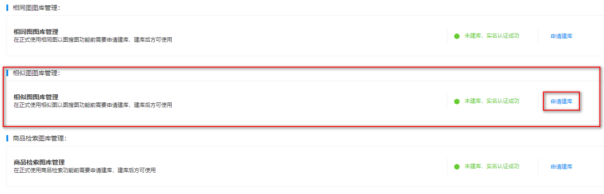

点击 **申请建库** ,  根据需求填写:

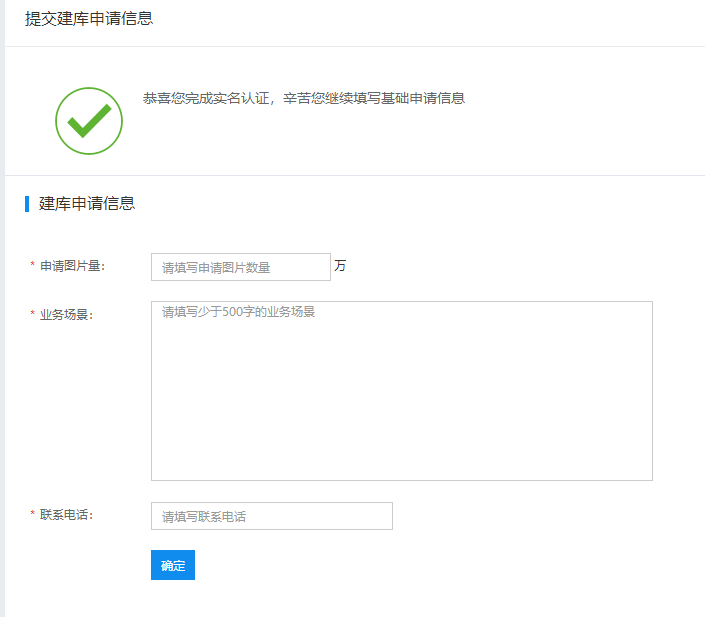


填写完成后, 点 **确定 ** 即可!


# 2, 编写测试代码

百度AI, 提供了详细的文档, 文档地址: http://ai.baidu.com/docs#/ImageSearch-Java-SDK/top,  虽然文档很详细, 但只有代码片段, 这里参考官方文档, 写一个小Demo,  以Java为例.

## A, 获取APPID/AK/SK

首先获取APPID/AK/SK,  在**百度云-管理中心,  图像搜索**这个**产品服务**中点击**应用列表**, 可以找到应用的APPID/AK/SK, 如下图所示:

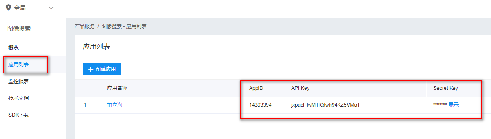

使用时直接复制即可!

## B,  编写测试代码

有了APPID/AK/SK, 就可以愉快的写测试代码了!

### i,  配置APPIP/AK/SK

```java
    /**
     * 你申请的APPID
     */
    public static final String APP_ID = "14393394";
    /**
     * 你申请的API Key
     */
    public static final String API_KEY = "jxpacHlwM1IQtwh94KZ5VMaT";
    /**
     * 你申请的Secret Key
     */
    public static final String SECRET_KEY = "Zd3pHhGt0lDD40xFSGlT9GA5FIVKTvjt";
```

### ii, 相似图片入库 -- 核心代码及结果

##### 1, 核心代码: 

```java
    /**
     * 图片入库
     */
    public static void insert(AipImageSearch client) {
        // 传入可选参数调用接口
        HashMap<String, String> options = new HashMap<String, String>();
        // 数据格式为json, 可以定义多种属性, 这里以name为例, 所有图片都是刘德华
        options.put("brief", "{\"name\":\"刘德华\"}");
        // 文件标签, 这个先不填, 实际项目时, 根据实际需求来
        //  options.put("tags", "100,11");

        //  images 目录下的base目录训练图片, test是测试图片, 这里把训练图片全部入库
        File images = new File("images/base");
        // 获取目录下的所有图片
        File[] files = images.listFiles();
        for (File f : files) {
            // 上传图片入库
            JSONObject res = client.similarAdd(f.getAbsolutePath(), options);
            // 打印上传结果
            System.out.println(res.toString(2));
        }
    }
```

##### 2, 本地图片:

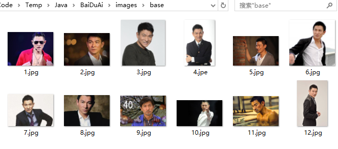

##### 3, 相似图库结果:

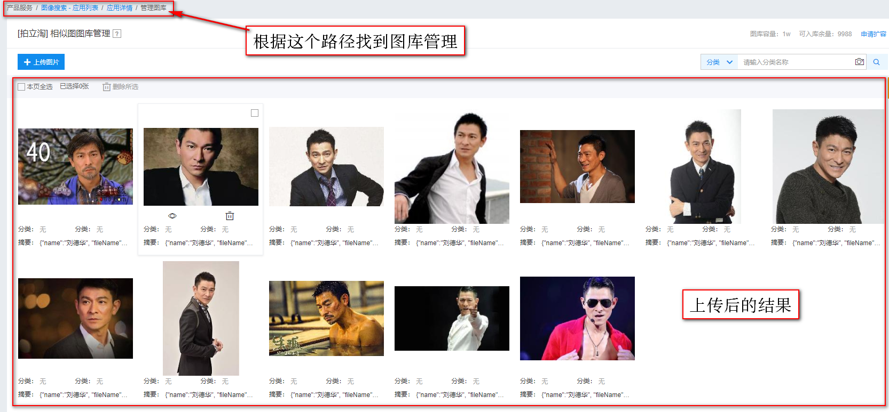

### iii, 相似图片搜索 -- 核心代码

##### 1, 核心代码: 

```java
/**
     * 相似图片搜索
     */
    public static void query(AipImageSearch client) {
        /**
         * 传入可选参数调用接口, 根据需求来, 参数越详细结果越准确, 这里图片较少, 只写页码和条数
         * 经测试指定页码和条数后, 会根据相似度排序, 最高的排在前面
         */
        HashMap<String, String> options = new HashMap<String, String>();
        // 页码, 这里从第一页开始
        options.put("pn", "0");
        // 条数, 只显示两条, 也就是展示相似度最高的两张图片
        options.put("rn", "2");

        //  images 目录下的base目录训练图片, test是测试图片, 这里把测试图片全部测试
        File images = new File("images/test");
        // 获取目录下的所有图片
        File[] files = images.listFiles();
        for (File f : files) {
            // 输出文件名
            System.out.println(f.getName());
            // 进行相似查询,
            JSONObject res = client.similarSearch(f.getAbsolutePath(), options);
            // 打印上传结果
            System.out.println(res.toString(2));
        }
    }
```


##### 2, 本地图片( 刘德华本人 ):

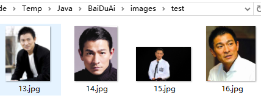

##### 3, 测试结果:

输出结果太多, 这里以**14.jpg**为例:

````json
// 14.jpg
{
  "result": [
    {
      "brief": "{\"name\":\"刘德华\", \"fileName\":\"3.jpg\"}",
      "score": 0.75743705034256,
      "cont_sign": "2130114795,1421728783"
    },
    {
      "brief": "{\"name\":\"刘德华\", \"fileName\":\"7.jpg\"}",
      "score": 0.7500102519989,
      "cont_sign": "2013882061,6605881"
    }
  ],
  "log_id": 3970070332979712567,
  "has_more": true,
  "result_num": 2
}
````

在训练库中图片: 3.jpg、 7.jpg与图片14.jps相似度较高! 图片对比如下:

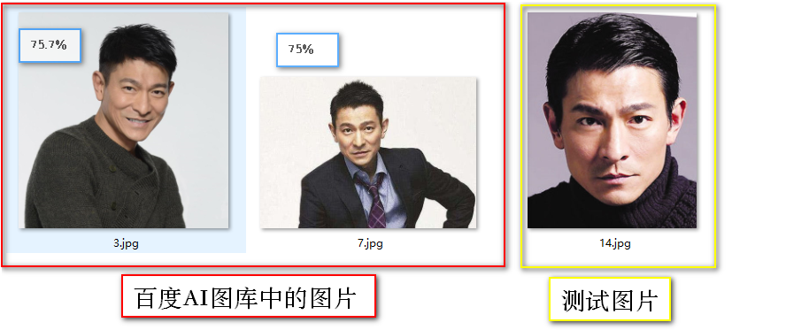

##### 4, 其他照片测试:

使用周杰伦和刘亦菲的图片进行测试, 测试图片如下图所示:

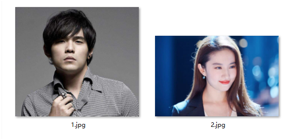

##### 5,  其他照片 - 测试结果:

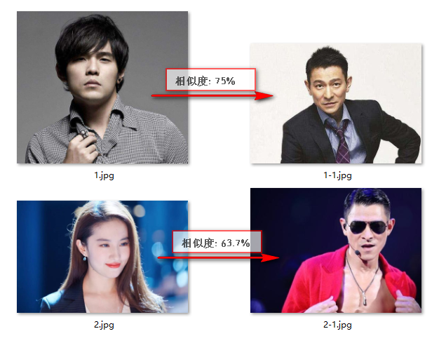

# 3, 总结

这里使用的是**相似图搜索**功能, 以偶像刘德华为例,  **由于图片没有重复且每张图的大小也不一样**,  存在干扰因素的情况下, 以刘德华本人的图片为例达到**75.7%**的识别度, 已经很高了,  在其他图片的测试中, 想似度最高也达到了**75%**, 这个结果偏高了, 百度图片搜索最近才全面开放的还在不断发展中, 相信将来一定可以做的很好, 文章中完整源码请访问获取:  https://github.com/oahzuw/CrazyCode/tree/master/Java/baidu_ai-image_search/BaiDuAi