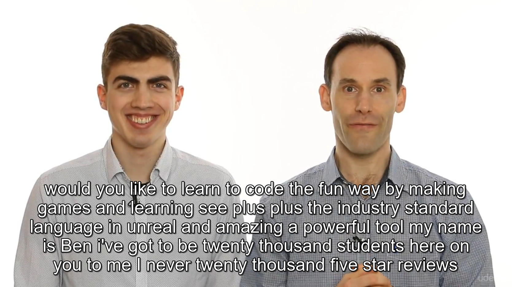

# 前因:
这段时间特别想学PC 3D游戏开发, 职业是Java开发, Java游戏开发基本凉凉, 知名游戏引擎UE4 与 Unity对比了下, 单纯的感觉UE4厉害, 就选择了UE4, 开发语言使用的语言是C++, UE4完全不会, C++只会基础语法, 没办法学吧, udemy.com上有很多相关优质教程, 搜了下有下载, 就下载了套, 观看时发现没有中文字幕, 表示野生程序员, 高中都没上过, 英文很差, 于是 -->>

英文视频制作中文字幕思路

	1, 使用ffmpeg把视频的音频分离出来
		-- 编写脚本
	2, 使用百度语音识别api, 把英文语句抽取出来, 打包成程序方便调用( c++ 玩的6可以直接写字幕文件, 可惜我玩的不6 )
		-- 百度长语语音识别只支持: Android离线、IOS离线、LinuxC++, 这里选用LinuxC++( 因为游戏开发也是用C++ ), 硬着头皮上吧
	3, 调用打包的语音抽取程序, 获取识别结果, 使用kotlin
	5, 外挂字幕观看视频
		-- 观看学习

# 动手
## 1, 编写脚本使用ffmpeg把视频的音频分离出来
	
以Ubuntu18.04为例, 安装ffmpeg:
	
	sudo apt install ffmpeg
这里分离出来的音频格式为pcm, 脚本如下( 脚本名:[mp4topcm.sh](mp4topcm.sh), 使用时需要与mp4视频同一目录 ):

	#!/bin/sh
	for file in `find . -name '*.mp4'`
	do ffmpeg -i $file -vn -y -acodec copy -acodec pcm_s16le -f s16le -ac 1 -ar 16000 $file.pcm;
	done
以上脚本测试环境: Ubuntu18.04( 虚拟机 ), Mingw64, 都通过, 由于开发环境是Win10, 我这里脚本最终执行环境为:Mingw64

PS: 由于长语音识别需要Linux环境, 这里使用的 Bash on Windows, 版本也是Ubuntu18.04, 但上面脚本不能正常运行

bash 环境参考: https://docs.microsoft.com/zh-cn/windows/wsl/install-win10

## 2, 使用百度语音识别api, 把英文语句抽取出来, 打包成程序方便调用( cpp )

这是使用百度语音官方demo asrDemo2, 根据自已的需求做了简单的修改( 现在的C++水平复杂的也改不了 ), [详情见](BaiduSpeech.md)

## 3, 调用打包的语音抽取程序, 获取识别结果, 使用kotlin
使用kotlin调用步骤2打包的程序获取识别结果, 并写入字幕文件(英文), 同时调用Google翻译获取中文结果, 把英文字幕文件处理为中文, 保存为新的字幕文件, 本来计划做中文双语的, 但是测试时发现, 语音识别是按说话停留间隔的, 如果一句话间隔较小, 程序会认为是连续说话, 导致出现满屏字幕, 仅英文就满屏字幕的话无法实现, 识别出来的英文字幕又不想浪费, 所以采用两个字幕文件的方试, 关键代码如下:

[详细代码](speech/KotlinSpeech.md)

## 4, 外挂字幕观看视频
如下图:

观看学习 --<完>

# 自问自答
#### Q: 一个Javaer, 调用程序时为什么使用kotlin
#### A: 总要接触新的事物, kotlin的语法用起来很爽, 代码中也直接用了Java的库

#### Q:  你想问什么?
#### A:  我来回答 !

# 本文章地址: https://github.com/oahzuw/CrazyCode