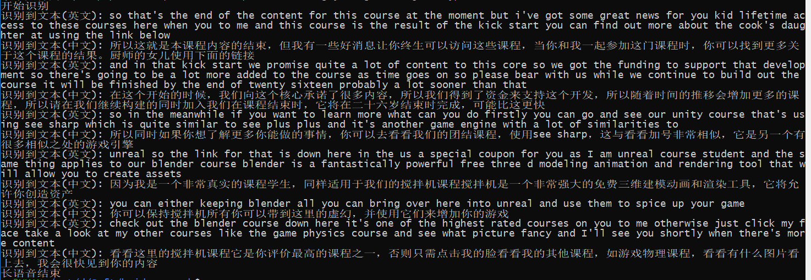

此目录存放已打包好的程序, 使用命令如下:
	
	# 使用前需要先进行语音分离, 把mp4topcm.sh复制到视频所在目录执行即可把所有mp4视频的语音分离出来保存为pcm格式
	# 调用打包百度语音识别程序并生成字幕 
	java -jar ./speech.jar /you/pcm/path

运行日志如下图:

目录内文件说明:

	.
	├── speech.jar  # 百度长语音识别调用程序, 并把结果处理为字幕文件
	├── BDS_Ident.dat # 百度长语音需要的文件, 自动生成的
	├── bds_easr_mfe_cmvn.dat # 百度长语音需要的文件
	├── bds_easr_mfe_dnn.dat # 百度长语音需要的文件
	└── speech2text # 打包的百度长语音识别程序, 使用speech.jar调用